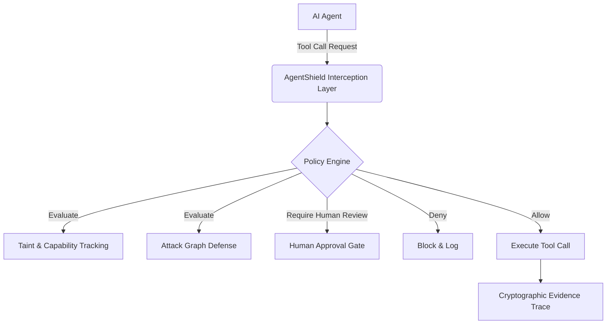

# AgentShield Veritas - Community Edition

   

## Overview

**AgentShield Veritas (Community Edition)** is a professional, open-source AI-agent security runtime. It is designed to evaluate, test, and enforce deterministic security policies for AI agents, preventing unauthorized side-effects, secrets exfiltration, and unintended tool executions.

> **Note:** This is the Community Edition of AgentShield Veritas. Enterprise capabilities, advanced audit tools, commercial integration recipes, and proprietary corpus datasets are not included in this release.

AgentShield Veritas provides a local, deny-by-default security layer. It evaluates what an agent is attempting to do—whether through an MCP (Model Context Protocol) server or custom framework adapters—and applies a deterministic policy before any side effect occurs. The system acts as a policy engine, a benchmark suite for testing agents, and a security guardrail.

## Features

- **Deny-by-Default Policy Engine**: Enforces strict security boundaries deterministically.
- **Provider-Neutral Tool-Call Adapter**: Normalizes tool calls across OpenAI, Anthropic, and Gemini.
- **Local Attack Benchmark Corpus**: A built-in suite of mock scenarios (Corpus v3) to test agent security.
- **Tamper-Evident Evidence Traces**: Cryptographically hash-chained evidence logs of all agent actions.
- **Human Approval Gate**: Pluggable manual review flows for critical actions.
- **Taint & Capability Tracking**: Prevents sensitive data from flowing into untrusted execution sinks.
- **Attack Graph Explainability**: Identifies and explains multi-step attack patterns.
- **Adapter Conformance Harness**: Ensures custom adapters follow security protocols.

## Architecture Diagram



## Installation

AgentShield requires Node.js >= 20 and pnpm >= 9.

Clone the repository and install dependencies:

```sh
pnpm install
pnpm build
```

## Quick Start

Evaluate the system locally using the CLI:

```sh
pnpm cli -- init
pnpm cli -- sdk demo
pnpm cli -- bench --ci
pnpm cli -- mcp-conformance
```

## CLI Usage

AgentShield provides a powerful CLI for policy management, auditing, and execution.

**Audit a policy:**
```sh
pnpm cli -- policy-audit examples/policies/strict.policy.json
```

**Generate a policy from a template:**
```sh
pnpm cli -- policy-template init strict-mcp-local --out generated.policy.json
```

**Scan for sensitive data:**
```sh
pnpm cli -- sensitive scan examples/sensitive/sample-sensitive-input.json
```

### Quick Evaluation in 10 Minutes

Run this compact evaluation flow from the repository root:

```sh
pnpm cli -- bench --ci
pnpm cli -- policy-audit examples/policies/strict.policy.json
pnpm cli -- policy-test examples/policy-tests/strict.policy-test.json
pnpm cli -- adapter-conformance examples/custom-adapter/adapter-conformance.json
pnpm cli -- workspace validate examples/workspace/agentshield.workspace.json
```

### Policy Packs

Policy packs are curated, versioned Policy v2 rule bundles with metadata, compatibility profiles, required checks, validation, and audit support.

```sh
pnpm cli -- policy-pack list
pnpm cli -- policy-pack validate examples/policy-packs/strict-mcp-local.pack.json
```

## SDK Usage

Integrate AgentShield directly into your Node.js applications:

```typescript
import { AgentShieldClient } from "@agentshield/sdk";

const client = new AgentShieldClient({ policyPath: "./policy.json" });
const result = await client.evaluateToolCall({
  tool: "shell.exec",
  args: { command: "ls -la" }
});

if (result.action === "allow") {
  // Execute safely
}
```

## Policy Engine

AgentShield assumes LLMs are untrusted inputs. It implements a **Fail-Closed** and **Deny-by-Default** model. No shell, network, or filesystem modifications are permitted unless explicitly allowed by deterministic policies.

**Example strict policy:**
```json
{
  "version": "2",
  "name": "strict-readonly",
  "rules": [
    { "action": "deny", "capabilities": ["shell.exec", "network.write"] },
    { "action": "allow", "capabilities": ["filesystem.read"] }
  ]
}
```

Validate this policy:
```sh
pnpm cli -- check examples/policies/strict.policy.json
```

## Examples

The `examples/` directory contains fully self-contained demonstrations:
- `examples/demo-agent`: Safe local mock agent.
- `examples/policies`: Example policy configurations.
- `examples/custom-adapter`: Custom SDK adapters.
- `examples/workspace`: Workspace setups.

## Project Structure

- `packages/core` - Policy, taint, trace, and fingerprinting primitives.
- `packages/runtime` - Orchestration and adapter integration.
- `packages/cli` - Command-line interface.
- `packages/bench` - Attack benchmark runner.
- `packages/registry` - Metadata registry.
- `packages/mcp-adapter` - JSON-RPC adapter for MCP mock tools.
- `packages/sdk` - TypeScript integration API.
- `examples/` - Local deterministic examples.
- `docs/` - Comprehensive architecture and integration documentation.

## Documentation

- [Architecture](docs/architecture.md)
- [Security Invariants](docs/security-invariants.md)
- [Workspace Config](docs/workspace-config.md)
- [Policy v2](docs/policy-v2.md)
- [Benchmark v2](docs/benchmark-v2.md)
- [SDK Integration](docs/sdk.md)
- [Evidence Traces](docs/evidence-trace.md)
- [Capabilities](docs/capability-model.md)

## Contributing

We welcome contributions! Please read our [Contributing Guide](CONTRIBUTING.md) and [Code of Conduct](CODE_OF_CONDUCT.md).

All changes must pass the internal test suite:
```sh
pnpm test
```

## Security

AgentShield Veritas operates at the application layer and is not an OS sandbox. There is no hosted SaaS backend. 
Please report security issues privately. For security concerns, refer to [SECURITY.md](SECURITY.md).

## License

This project is licensed under the [Apache License 2.0](LICENSE).
Copyright (c) 2026 Tilak Ostwal.

## FAQ

**Does AgentShield prevent all prompt injections?**
No tool can prevent all prompt injections. AgentShield focuses on neutralizing the *impact* of a prompt injection by denying unauthorized side effects and tool executions deterministically.

**Does AgentShield support Python?**
Currently, AgentShield provides a native TypeScript/Node.js SDK, but it can intercept tool calls via standard JSON-RPC (MCP) which is language agnostic.